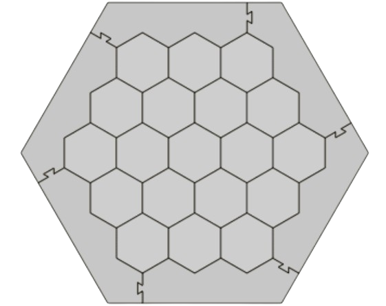
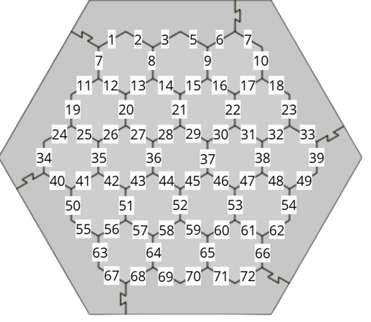
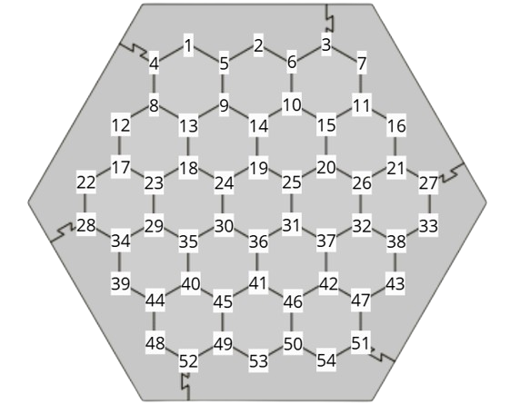

# 🏝️ CatanIA - Jeu en ligne inspiré de Catan 🎲

## 📜 Description du projet

CatanIA est une implémentation en ligne du jeu de société **Catan**, développée en Python 🐍. Il permet aux joueurs de s'affronter dans une partie **multijoueur**, en plaçant des **colonies**, des **routes** et en développant leurs **ressources** stratégiquement. 🚀

## ⭐ Fonctionnalités principales

- 🏠 **Placement des colonies et routes** : Les joueurs peuvent placer des colonies et des routes sur le plateau de jeu.
- 🔄 **Tour par tour** : Le jeu suit un système de **tours alternés** entre les joueurs.
- 🎲 **Gestion des ressources** : Les joueurs reçoivent des ressources en fonction des dés lancés et de leurs colonies.
- 🏗️ **Construction et expansion** : Possibilité de **construire des routes**, établir de **nouvelles colonies** et les améliorer en **villes**.
- 🛤️ **Gestion des routes les plus longues** : Calcul automatique de la plus longue route d'un joueur.

## Plateau du jeu Catan


## Positions des routes


## Positions des colonies


## 🛠️ Technologies utilisées

- 🐍 **Python** : Langage principal du backend

## 🚀 Installation et exécution

1. 📥 **Cloner le projet** :
   ```sh
   git clone https://github.com/votre-utilisateur/CatanIA.git
   cd CatanIA
   ```
2. 📦 **Installer les dépendances** :
   ```sh
   pip install -r requirements.txt
   ```
3. 🎮 **Lancer le jeu** :
   ```sh
   python Game_2_players.py
   ```

## 📂 Structure du projet

```
CatanIA/
│-- 🗺️ Board.py          # Gestion du plateau de jeu
│-- 🃏 Deck.py           # Gestion des cartes
│-- 🎲 Dice.py           # Gestion des dés
│-- 🎮 Game_2_players.py # Script principal du jeu
│-- 🧑‍🤝‍🧑 Player.py         # Gestion des joueurs
│-- 📄 README.md         # Documentation du projet
│-- 📂 __pycache__/      # Fichiers compilés Python
```

## 🎯 Fonctionnement du jeu

- 🏁 **Début de la partie** : Chaque joueur place ses colonies et routes initiales.
- 🔄 **Tours de jeu** : Chaque joueur lance les dés, reçoit des ressources et peut construire.

## Projet lié : Full Stack Catan

Pour plus de détails sur la génération visuelle du plateau avec une application Full Stack utilisant une API, vous pouvez consulter le dépôt suivant :

[Full Stack Catan - Génération du plateau visuellement avec l'application Full Stack API](https://github.com/TheoLindqvist4/FullStackCatan)

## ✨ Auteurs

- [Théo Lindqvist](https://github.com/TheoLindqvist4) 🖊️👨‍💻
