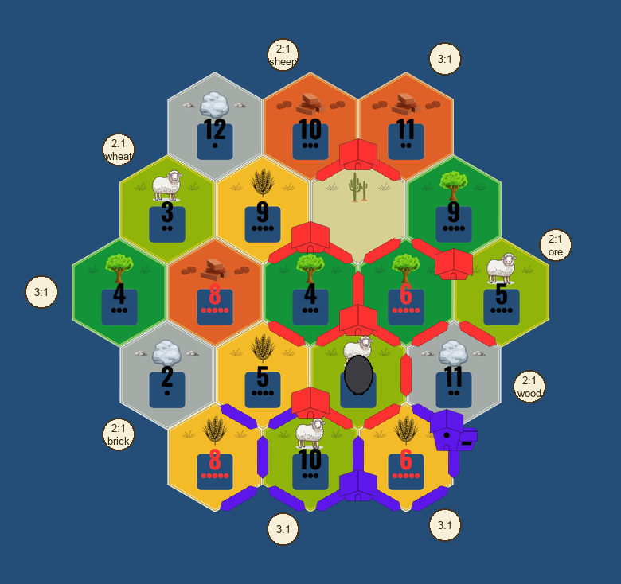
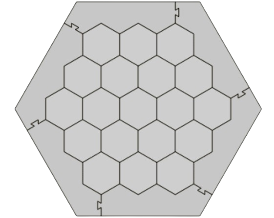
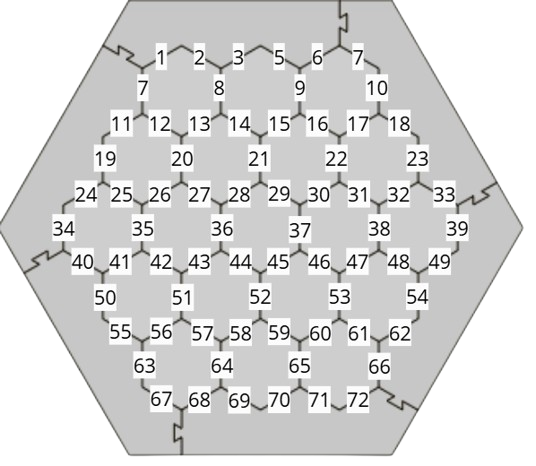
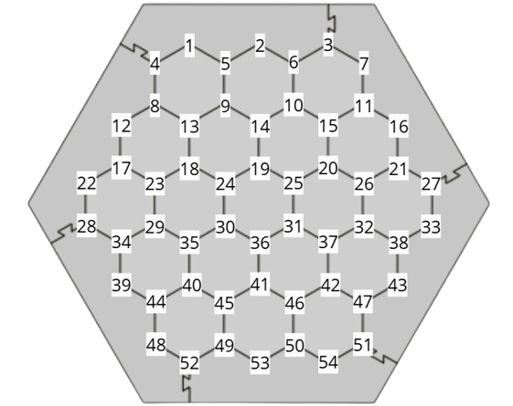

# 🏝️ CatanIA - Jeu en ligne inspiré de Catan 🎲

## 📜 Description du projet

CatanIA est une réimplémentation du jeu de société **Catan** en Python 🐍. L'objectif principal
n'est pas seulement de pouvoir y jouer : c'est d'exposer **l'intégralité de l'état de la partie**
sous une forme lisible par une machine, afin d'**entraîner une IA** à jouer. L'interface de jeu est
un *consommateur* du moteur, jamais une partie de celui-ci.

> ✅ **Le moteur est complet.** `catan/` implémente **toutes les règles du Catan de base**, à la
> seule exception de l'échange entre joueurs (volontairement hors périmètre pour cette version).
> Reste à construire la couche destinée à l'IA : espace d'actions, encodage des observations et
> environnement d'entraînement (phase 3).
>
> - **[ROADMAP.md](ROADMAP.md)** — les phases, ce qui est fait et ce qui reste.
> - **[docs/engine.md](docs/engine.md)** — comment le moteur s'articule et comment piloter une
>   partie.
> - **[docs/ai-surface.md](docs/ai-surface.md)** — comment entraîner une IA dessus : espace
>   d'actions, encodage des observations, environnement et agents de référence.
> - **[docs/](docs/README.md)** — l'audit initial, la référence de la géométrie, et les décisions
>   clés (avec leurs justifications et les écarts assumés par rapport aux règles officielles).

## ⭐ État actuel

**Fonctionne** (598 tests) :

- 🗺️ **Géométrie du plateau** : 19 tuiles, 54 emplacements de colonies, 72 emplacements de routes,
  toutes les relations d'adjacence — **générées** et vérifiées contre les schémas de `Images/`.
- 🎲 **Génération du plateau** : distribution standard des jetons et des ressources, avec une règle
  d'équilibrage (pas de nombres identiques adjacents, ni 6/8 ni 2/12).
- 🧭 **Modèle d'état complet** : propriétaire et type de chaque sommet, propriétaire de chaque
  route, mains, réserves de pièces, phase et tour. Copie (`clone`) économique pour la recherche.
- ⚖️ **Une seule autorité de légalité** : `legal_actions` et `apply` partagent les mêmes
  prédicats — un coup ne peut pas être proposé par l'un et refusé par l'autre.
- 🏠 **Construction** : routes, colonies et **villes**, avec le coût réellement débité, la règle de
  distance, la connectivité, et le blocage par une construction adverse.
- 🎲 **Production** selon les dés, doublée pour les villes.
- 🏦 **La banque** : 19 cartes par ressource, conservation des cartes (toujours 95 au total) et la
  règle officielle de pénurie.
- 🔄 **Échange avec la banque** à 4:1, et **les ports** à 3:1 et 2:1. Ports placés aléatoirement
  mais régulièrement espacés ; les deux extrémités d'un port en donnent le bénéfice, mais la règle
  de distance fait qu'un seul joueur peut en profiter.
- 🦹 **Le voleur** : gestion du 7, défausse de la moitié de la main au-delà de 7 cartes, blocage de
  la production de sa tuile, et vol d'une carte au hasard.
- 🃏 **Cartes de développement** : pioche de 25 cartes, achat, et les deux règles de timing
  (une carte par tour, et pas celle achetée dans le tour). Chevalier, Construction de routes,
  Année d'abondance, Monopole, et Point de victoire — cette dernière n'est jamais jouée : elle
  compte tant qu'elle est en main et reste cachée.
- 🎖️ **Armée la plus puissante** (3 chevaliers) et **route la plus longue** (5 segments),
  2 points chacune, conservées jusqu'à être strictement dépassées.
- 🏆 **Points de victoire et victoire à 10.**
- 🛤️ **Plus longue route** : chemin simple strict, interrompu par une construction adverse.
- 👥 **2 à 4 joueurs.**
- 🔁 **Déterminisme** : une partie est entièrement reproductible à partir d'une graine (`seed`).

- 🖼️ **Rendu du plateau** : `interfaces/render.py` dessine une partie en PNG à partir des
  coordonnées du moteur.
- 🤖 **Couche IA** : espace d'actions discret de **324** indices avec masque de légalité,
  observation de **1808** flottants (perspective tournée — « moi » est toujours le joueur 0),
  masquage de l'information cachée, et un environnement `reset` / `step`. Environ **3 700
  pas/seconde**. Agents de référence : aléatoire et glouton.

**Pas encore implémenté :** l'échantillonnage de l'information cachée (prérequis pour un MCTS),
l'interface en ligne de commande et l'API web — phase 4. Détails dans [ROADMAP.md](ROADMAP.md).

**Volontairement hors périmètre :** l'échange entre joueurs. La cible est le 1 contre 1, où céder
des ressources profite au seul adversaire capable de vous battre — et une offre libre est un
échange « ensemble contre ensemble » qui ne se ramène pas à un espace d'actions discret.
Voir [décision 0011](docs/decisions/0011-no-player-to-player-trading.md).

> 📈 **L'échange a rendu les parties jouables.** Avant lui, seules **4 parties sur 40** atteignaient
> 10 points : une colonie coûte quatre ressources différentes, or les colonies d'un joueur n'en
> atteignent souvent que trois, et sans conversion possible les joueurs restaient bloqués avec plus
> de 100 cartes inutilisables. Aujourd'hui : **40 parties sur 40** se terminent (349 tours en
> médiane). Détails : [docs/engine.md](docs/engine.md#trading-is-what-made-games-finishable).

## Une partie rendue par le moteur



Image produite par `interfaces/render.py` à partir d'un `GameState` : les tuiles, les
sommets **et** les routes viennent tous du réseau de coordonnées de `catan.topology`, donc le
rendu n'est qu'une application linéaire — aucune logique de placement séparée à maintenir.
Illustrations reprises de
[FullStackCatan](https://github.com/TheoLindqvist4/FullStackCatan).

```python
from catan.env import CatanEnv
from interfaces.render import save

env = CatanEnv(); env.reset(seed=12)
save(env.state, "board.png")
```

## Schémas de référence du plateau



## Positions des routes



## Positions des colonies



## 🛠️ Technologies utilisées

- 🐍 **Python** : Langage principal du backend

## 🚀 Installation et exécution

1. 📥 **Cloner le projet** :
   ```sh
   git clone https://github.com/votre-utilisateur/CatanIA.git
   cd CatanIA
   ```
2. 📦 **Installer les dépendances** :
   ```sh
   pip install -r requirements.txt
   ```
3. 🎮 **Jouer dans le navigateur** (recommandé) :
   ```sh
   python -m interfaces.web
   ```
   Puis ouvrir <http://127.0.0.1:8000>. On clique directement sur le plateau pour poser une
   colonie, une route ou une ville ; les emplacements légaux clignotent. Le dé, les mains, les
   cartes, la banque, le voleur et le journal de la partie sont affichés en permanence.
   L'adversaire se choisit dans le menu déroulant — `hard` par défaut. Aucune dépendance :
   uniquement la bibliothèque standard.

4. ⌨️ **Ou jouer dans le terminal** :
   ```sh
   python -m interfaces.cli                          # vous contre l'IA la plus forte
   python -m interfaces.cli --agents human easy      # un adversaire plus accessible
   python -m interfaces.cli --agents hard greedy     # observer deux agents
   python -m interfaces.cli --games 20 --quiet       # comparer, résultats seuls
   python -m interfaces.cli --render out/            # écrire un PNG par action
   ```

5. 🤖 **Ou piloter le moteur depuis du code** :
   ```python
   from catan.env import CatanEnv

   env = CatanEnv(num_players=2)          # règles du 1 contre 1 classé
   obs, info = env.reset(seed=0)

   while not info["done"]:
       action = mon_agent(obs, info["mask"])          # un indice, doit être légal
       obs, reward, terminated, truncated, info = env.step(action)

   print(info["winner"], info["scores"])
   ```

   Voir [docs/engine.md](docs/engine.md) et [docs/ai-surface.md](docs/ai-surface.md).

## 📂 Structure du projet

```
CatanIA/
│-- 📦 catan/                 # Le moteur
│   │-- 📐 topology.py        #   Géométrie du plateau (générée, gelée à l'import)
│   │-- 🌾 resources.py       #   Les cinq ressources et les coûts
│   │-- 🗺️ board.py           #   Une disposition de plateau — IMMUABLE
│   │-- 🧭 state.py           #   GameState : tout ce qui change pendant la partie
│   │-- 🎯 actions.py         #   Action = (type, position, extra)
│   │-- ⚖️ rules.py           #   legal_actions / apply — l'unique autorité de légalité
│   │-- 🎲 dice.py            #   dés simples, ou le paquet de 36 « dés équilibrés »
│   │-- 📜 rulesets.py        #   jeu de base ou 1 contre 1 classé (par défaut)
│   │-- 🃏 dev_cards.py       #   la pioche de 25 cartes
│   │-- 🎯 action_space.py    #   324 indices + masque de légalité
│   │-- 👁️ encoder.py         #   l'observation destinée au réseau
│   │-- 🕹️ env.py             #   environnement reset / step
│   │-- 👓 view.py            #   ce qu'un joueur a le droit de voir (liste blanche)
│   │-- 🧠 heuristics.py      #   évaluation des positions (valeur marginale)
│   │-- 🤖 agents.py          #   agents de référence et arène de matchs
│-- 🧠 training/              # Auto-apprentissage (seul endroit qui importe PyTorch)
│   │-- net.py               #   réseau politique/valeur, masquage inclus
│   │-- rollout.py           #   collecte par siège, GAE, récompense terminale
│   │-- ppo.py               #   la mise à jour et ses diagnostics
│   │-- pool.py              #   adversaires gelés + ancre heuristique
│   │-- clone.py             #   démarrage à chaud par imitation
│   │-- evaluate.py          #   taux de victoire et intervalles de confiance
│   │-- agent.py             #   PolicyAgent — se branche comme tout autre agent
│   │-- train.py             #   la boucle
│-- 🖥️ interfaces/            # Les seules parties qui affichent quelque chose
│   │-- 🖼️ render.py          #   rendu du plateau en PNG
│   │-- ⌨️ cli.py             #   jouer ou observer une partie en terminal
│   │-- 🌐 web/               #   le jeu jouable dans le navigateur
│   │   │-- api.py            #     la partie sous forme de dictionnaires (testable)
│   │   │-- server.py         #     serveur HTTP minimal (bibliothèque standard)
│   │   │-- static/           #     plateau SVG, clic pour jouer
│-- 🧪 tests/                 # Suite de tests (pytest)
│-- 📚 docs/                  # Audit, géométrie, moteur, décisions clés
│-- 🛣️ ROADMAP.md             # État du projet et phases
│-- 📄 README.md              # Documentation du projet
│
```

`catan/topology.py` ne contient **aucune** table écrite à la main. Toute la géométrie est
**générée** à partir d'une seule ligne :

```python
ROW_LENGTHS = (3, 4, 5, 4, 3)
```

Les centres des hexagones sont placés sur un réseau d'entiers, les sommets partagés sont fusionnés
par égalité exacte, puis les identifiants sont attribués par position : les sommets triés par
`(y, x)`, les routes par `(y minimal, x₁+x₂)`. Les identifiants obtenus sont **identiques** à ceux
dessinés dans `Images/` — les tests le vérifient, donc les schémas et le code ne peuvent pas
diverger.

Cela supprime environ 440 lignes de données maintenues à la main, rend impossible toute
désynchronisation entre les relations (deux entrées de l'ancienne table route→routes étaient
incorrectes, ce qui faussait silencieusement le calcul de la plus longue route), et accélère les
recherches d'un facteur 145. Détails et schémas : **[docs/board-geometry.md](docs/board-geometry.md)**.

## 🤖 L'adversaire

`HeuristicAgent` choisit **où**, pas seulement **quoi** — c'est toute la différence avec l'agent
glouton, qui ordonnait bien ses constructions puis plaçait au hasard. L'idée centrale est la
**valeur marginale** : une colonie ne vaut pas la somme de ses tuiles, elle vaut ce que ces tuiles
ajoutent à ce que l'on produit déjà. Un troisième blé vaut bien moins qu'un premier minerai.

Trois niveaux, réglés par un seul bouton — du **bruit** ajouté à chaque évaluation. Un adversaire
facile *se trompe* sur la valeur des emplacements, comme un joueur humain plus faible ; on ne lui
retire aucune règle. Sur 60 parties, sièges inversés :

| | | | |
|---|---|---|---|
| hard vs random | 98.3% | hard vs medium | 73.7% |
| hard vs greedy | 96.7% | hard vs easy | 80.0% |
| medium vs greedy | 96.6% | medium vs easy | 69.5% |
| easy vs greedy | 91.7% | greedy vs random | 75.0% |

**Il ne peut pas tricher.** Un agent ne reçoit pas l'état de la partie mais un
[`PublicView`](catan/view.py) à liste blanche explicite : lire la main de l'adversaire lève une
`AttributeError`. Un test rejoue une partie entière et exige le même coup à chaque décision une
fois les cartes cachées de l'adversaire réécrites.

Détails : [décision 0016](docs/decisions/0016-heuristic-opponent-and-difficulty.md).

## 🧠 Entraîner un agent (Phase 8)

Le moteur reste **sans dépendance**. Seul le paquet `training/` importe PyTorch, et les deux
interfaces fonctionnent sans lui.

```sh
pip install torch --index-url https://download.pytorch.org/whl/cpu

python -m training.clone --games 300                 # imiter l'heuristique (~4 min)
python -m training.train --resume checkpoints/cloned.pt --iterations 400 --lr 1e-4
python -m training.agent checkpoints/best.pt checkpoints/policy.pt   # version jouable, 5 Mo
```

Le dernier appel écrit `checkpoints/policy.pt`, que les deux interfaces détectent
automatiquement et proposent sous le nom `learned`.

**PPO plutôt qu'AlphaZero.** Une recherche arborescente a besoin d'un état que l'on peut
dérouler ; ici `clone()` copie la pioche de développement, le paquet de dés et les cartes de
l'adversaire *à l'identique*, donc une simulation rejoue le même futur au lieu d'en
échantillonner un. L'échantillonnage de croyances est un prérequis, et il n'est pas écrit.

**Ce qui est mesuré.** Le clonage atteint 30.8% contre l'heuristique en quatre minutes ;
l'affinage par PPO monte ensuite à la parité en 68 minutes de CPU. Sur 1 000 parties :

| adversaire | résultat | taux | IC 95% |
|---|---|---|---|
| heuristique `hard` | 507 – 467 | **52.1%** | [48.9, 55.2] |
| heuristique `medium` | 299 – 97 | 75.5% | [71.0, 79.5] |
| `greedy` | 399 – 1 | 99.8% | [98.6, 100.0] |
| `random` | 399 – 1 | 99.8% | [98.6, 100.0] |

L'intervalle contient 50% : c'est donc une **parité**, pas une victoire démontrée. Contre tout
ce qui est plus faible, l'agent entraîné domine nettement — 99.8% contre `greedy`, là où
l'heuristique elle-même fait 96.7%. `hard` reste l'adversaire par défaut.

Détails et limites : [décision 0017](docs/decisions/0017-ppo-self-play.md),
[décision 0018](docs/decisions/0018-clone-before-self-play.md).

## 🧪 Tests

```sh
python -m pytest tests -q
```

## 🎯 Fonctionnement du jeu

- 🏁 **Début de la partie** : Chaque joueur place ses colonies et routes initiales.
- 🔄 **Tours de jeu** : Chaque joueur lance les dés, reçoit des ressources et peut construire.

## Projet lié : Full Stack Catan

Pour plus de détails sur la génération visuelle du plateau avec une application Full Stack utilisant une API, vous pouvez consulter le dépôt suivant :

[Full Stack Catan - Génération du plateau visuellement avec l&#39;application Full Stack API](https://github.com/TheoLindqvist4/FullStackCatan)

## ✨ Auteurs

- [Théo Lindqvist](https://github.com/TheoLindqvist4) 🖊️👨‍💻
